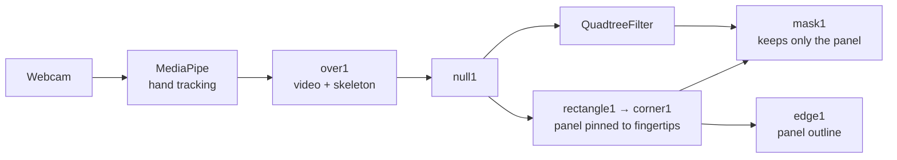

# Hand-Tracked Quadtree Pixelation

A real-time video filter built in TouchDesigner. You hold up both hands, and the
region stretched between them becomes a live "screen" where the image breaks
itself into blocks — fine blocks where there is detail, large blocks where there
is not. A shifting random selection of those blocks is pixelated while the rest
stay as untouched live video, so the surface constantly reshuffles between raw
and abstract.

<!-- Add a GIF or screenshot here -->

---

## What you are looking at

Two things are happening at once.

**Your hands define a panel.** Hand tracking finds the tip of each thumb and
each index finger. Those four points become the four corners of a quadrilateral,
so the panel stretches, skews and rotates as you move. The effect appears only
inside it.

**The image divides itself.** A *quadtree* is a way of cutting a picture into
squares, where any square that still contains too much visual detail gets split
into four smaller ones, and each of those is tested again. Busy areas end up
finely divided; flat areas stay chunky. The result is a mosaic whose resolution
follows the content of the image rather than a fixed grid.

Every division is then filled with the single average colour of whatever is
inside it — which is exactly what pixelation is, except the pixel size is
different in every part of the frame. Finally, a random subset of divisions is
left as sharp live video instead, and that subset is re-rolled a couple of times
a second.

## New to TouchDesigner?

TouchDesigner is a visual programming environment for real-time graphics. Rather
than writing a program top to bottom, you place **operators** (nodes) on a canvas
and wire them together; data flows left to right through the wires, and every
node re-computes 60 times a second.

Nodes are grouped by the kind of data they carry. The two that matter here are
**TOPs**, which pass images around on the GPU, and **CHOPs**, which pass streams
of numbers such as the coordinates of a tracked fingertip. A **COMP** is a
container that holds a whole sub-network and can be reused like a function.

You do not need to know any of this to run the project — but it explains why the
files below are node graphs rather than source code.

## How it works



The camera feed goes two ways. One branch draws the panel: a white rectangle is
corner-pinned to the four tracked fingertips, giving a solid shape that marks
where the effect belongs. The other branch runs the whole frame through the
quadtree filter. `mask1` multiplies the filtered image by the panel shape so
everything outside it falls away, and `comp2` lays that over the untouched
camera.

The ordering matters more than it looks. The filter has to run on a **complete,
opaque image** and be masked **afterwards**. Masking first means the filter
averages colour across the boundary between image and emptiness, which smears
colour outward past the panel edge.

### Inside the filter

```
in1 ──┬──────────────────► glsl1 input 1   (sharp — what the blocks are filled with)
      │
      └──► blur1 ────────► glsl1 input 2   (blurred — what the detail test measures)
```

The filter judges detail by taking 30 random samples inside a square and
measuring how much their colours vary. On a webcam, sensor grain varies plenty
all by itself, so a slightly blurred copy is used for that test — real edges
survive a small blur, noise does not. The sharp copy is still what gets sampled
for colour, so the raw-video blocks stay crisp.

There is no tree data structure anywhere. Each pixel independently works out
which square it belongs to using `floor(uv * divisions)`, and because every pixel
in a square does the same arithmetic, they all reach the same answer without
communicating. That single trick is what makes the whole thing run in one GPU
pass.

## The filter component

`mediapipe/filter_toxes/PixelatedProbQuadtreeFilter.tox`

A `.tox` is TouchDesigner's format for a single reusable component — the
equivalent of a library or a plugin. Drag it into any TouchDesigner project,
feed it a video input, and it works on its own; it has no dependency on the hand
tracking.

It contains the blur, the GLSL shader, and the input/output connectors, and
exposes four parameters on its front panel.

This component is a modified version of the original
[`ProbabilisticQuadtreeFilter.tox`](#references), which drew only the outlines of
the divisions over an unchanged image. The modifications add the block fill, the
random raw/pixelated selection, the time-based reshuffling, and the blurred
detail input. The unmodified original is kept alongside it for comparison.

## Parameters

On the component itself:

| Parameter | Meaning |
|---|---|
| **Variance Threshold** | How much detail is needed before a square splits. **Inverted** — lower values give *more* divisions. |
| **Min Divisions** | How many squares across the frame before any splitting happens. |
| **Max Iterations** | How many times a square may split. The smallest possible square is `1 / (Min Divisions × 2^Max Iterations)` of the frame. |
| **Resolution** | Reference resolution used to scale the threshold. |

Inside the component, on `glsl1`'s Vectors page:

| Uniform | Default | Meaning |
|---|---|---|
| `CELL_PIXELS` | `1` | `1` fills each division with one flat colour. `2` gives a 2×2 grid inside each, `4` a 4×4. |
| `PIXEL_AMOUNT` | `0.6` | Fraction of divisions that are pixelated. `0` is all raw video, `1` is all pixelated. |
| `CHANGE_SPEED` | `2` | Re-rolls per second. `0` freezes the pattern. |
| `OUTLINE` | `1` | Strength of the black stroke on division boundaries. |
| `DEBUG` | `0` | Set to `1` to see the structure directly: each division a distinct colour, depth shown in blue, raw-video divisions darkened. |

## Getting started

**Requires** TouchDesigner (2025.30000 or newer), a webcam, and a GPU supporting
OpenGL 4.

1. Open `pixel_handtracking.19.toe`
2. Allow camera access when prompted
3. Hold both hands up, palms toward the camera, thumbs and index fingers extended
4. The panel appears stretched between your fingertips

If the divisions look too uniform, lower **Variance Threshold**. If nothing
subdivides at all, lower it further — the useful range depends heavily on your
lighting.

## Challenges and what I learned

**The resolution the shader thought it had was not the resolution it had.** A
uniform was hard-set to 1024×1024 while every node in the chain was set to "use
input", so the filter was actually running at the webcam's 1280×720. Everything
derived from that number — block sizes, outline widths — was subtly wrong, and
because 16:9 is not square, blocks that were square in texture coordinates were
not square in pixels. Reading the true size with `textureSize()` inside the
shader fixed it. Lesson: never let a shader assume a resolution it can measure.

**Blocks have to be anchored to their own square.** Building the block grid
globally only nests cleanly inside each division when the division count and the
resolution are both powers of two. Anchoring each block to the corner of the
division it belongs to makes it correct at any resolution.

**A fix for flicker made things worse.** Squares sitting near the detail
threshold flip depth every frame on camera noise, which is very visible once
they are filled with flat colour. I built a two-stage system where the filter
remembered its previous decision and resisted changing it. That resistance was
self-reinforcing, so combined with a low threshold every square ratcheted down
to maximum depth and stayed there — producing a perfectly uniform grid that
responded to nothing. The whole stage came out again, and the noise was dealt
with at its source instead, by blurring the input to the detail test. Solving a
problem where it originates beat compensating for it downstream.

**Transparency is multiplied, not just flagged.** Setting the alpha channel to
zero outside the panel was not enough — TouchDesigner composites premultiplied,
so `over` computes `top.rgb + bottom.rgb × (1 - top.a)` and adds the colour
straight in regardless of alpha. The filtered frame ghosted across the entire
image. Multiplying colour *and* alpha by the mask together is what "premultiplied"
means, and once that clicked the fix was one node.

**GLSL sampler arrays are sized by what is actually connected.** Referencing
`sTD2DInputs[1]` on a node with one input is a compile error, not a runtime one,
and it shows up as a red-and-blue checkerboard rather than a message. The Info
DAT is where the real error text lives.

**`.toe` and `.tox` files are binary.** They can be unpacked into readable text
with `toeexpand.exe`, which ships with TouchDesigner — invaluable for finding out
what a network actually contains rather than what you assume it contains.

## Future improvements

- **Expose the shader uniforms as component parameters.** `CELL_PIXELS`,
  `PIXEL_AMOUNT` and `CHANGE_SPEED` currently live on the GLSL node's Vectors
  page, so tweaking them means going inside the component.
- **Root the quadtree in the panel's own space.** Right now the tree is computed
  across the whole frame and then cropped, so divisions are sliced mid-square at
  the panel edge. Unwarping the panel to a rectangle, filtering, then warping
  back would make the divisions fit the panel exactly.
- **Temporal stability without the ratchet.** The flicker problem is real and
  still unsolved; a correct approach would damp changes symmetrically rather
  than making depth sticky in one direction.
- **Audio reactivity** — drive `PIXEL_AMOUNT` or `CHANGE_SPEED` from live audio.
- **More per-division effects** than pixelation: colour quantisation, channel
  shifting, or a different treatment per depth level.
- **Gesture control** — pinch to change threshold, spread to change density.

## References

- **[Building a quadtree filter in GLSL using a probabilistic approach](https://ciphrd.com/2020/04/02/building-a-quadtree-filter-in-glsl-using-a-probabilistic-approach/)** — ciphrd. The algorithm this project is built on, and the source of the original `.tox`.
- **[MediaPipe TouchDesigner](https://github.com/torinmb/mediapipe-touchdesigner)** — Torin Blankensmith. Brings Google's MediaPipe hand landmark tracking into TouchDesigner.
- **[MediaPipe Hand Landmarker](https://ai.google.dev/edge/mediapipe/solutions/vision/hand_landmarker)** — Google. Documentation for the 21-point hand model.
- **[TouchDesigner documentation](https://docs.derivative.ca/)** — Derivative. Particularly the GLSL TOP and Composite TOP pages.
- **[Hash functions for GPU rendering](https://www.shadertoy.com/view/4djSRW)** — Dave Hoskins. The `hash14` function used for the per-division random roll.

## Credits

Quadtree algorithm by [ciphrd](https://ciphrd.com/). Hand tracking by
[Torin Blankensmith](https://github.com/torinmb/mediapipe-touchdesigner) and
Google MediaPipe. Pixelation, randomisation and integration by the author of
this repository.
